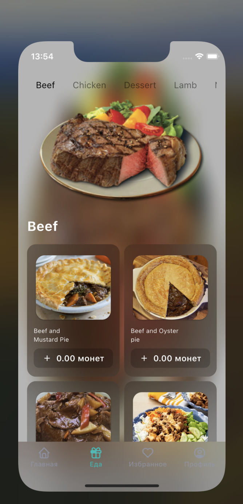

# mobile

A new Flutter template project.

## Getting Started

This project is a starting point for a Flutter application.

A few resources to get you started if this is your first Flutter project with Clean Architecture TDD:

To generate code: // flutter pub run build_runner build
To regenerate all code: // flutter pub run build_runner build --delete-conflicting-outputs
To generate locale constants: // flutter pub run easy_localization:generate -S assets/translations -f keys -O lib/core/constants -o locale_keys.g.dart

## Features

1. Generate LocalDataSourceImpl with built_runner
2. Generate Entity models with built_runner
3. Generate Api models via link with built_runner
